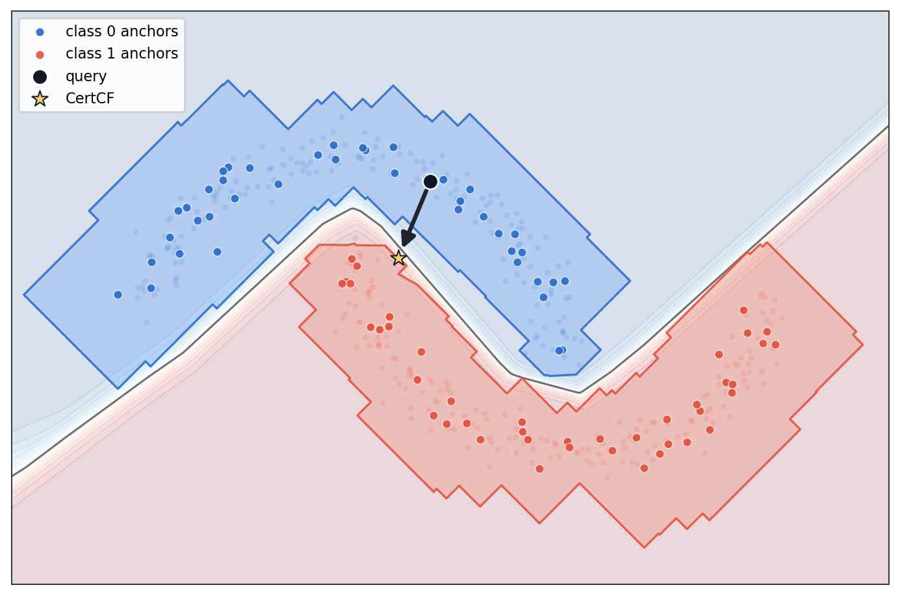

# CertCF: Certified Counterfactuals for Neural Networks

This repository contains the research code for **CertCF**, a counterfactual explanation method that connects counterfactual generation with neural network verification.

CertCF builds certified polytopic under-approximations of a target class preimage using LiRPA/CROWN bounds. At query time, counterfactual search becomes projection onto certified regions rather than an unconstrained pointwise search. Returned counterfactuals are accepted only when they satisfy the certified target-class constraints, giving validity by construction.



The current paper experiments focus on binary tabular datasets with one-hot encoded categorical features, actionability constraints, adaptive epsilon shrinkage, and a group-aware sparsity objective.

## Method At A Glance

```text
trained classifier + support data
        |
        v
LiRPA/CROWN bounds around target-class support points
        |
        v
certified atlas: union of target-class certified polytopes
        |
        v
nearest-anchor projection with tabular/actionability constraints
        |
        v
certified counterfactual
```

CertCF supports:

- certified target-class validity through LiRPA preimage under-approximations;
- L1/L2/Linf atlas and distance norms, with the paper benchmark using L1;
- one-hot simplex constraints and post-projection categorical decoding;
- immutable and directional feature constraints for actionability;
- adaptive epsilon shrinkage when a local certificate is too loose;
- optional group-aware reweighted-L1 sparsity selection;
- optional certified robustness through polytope erosion.

## Repository Layout

| Path | Purpose |
| --- | --- |
| `src/certcf/` | Core certified atlas, LiRPA integration, geometry, projection, and query logic. |
| `src/counterfactuals/` | Modular benchmark framework and method wrappers for CertCF, NN, Growing Spheres, DiCE, and FACE. |
| `src/training/` and `src/models/` | Lightning training modules and tabular classifier architectures. |
| `src/dataset_specs/` | Tabular feature metadata, one-hot slices, and feature groups. |
| `configs/training/` | Classifier training configs for the seven tabular datasets. |
| `configs/benchmarks/final_benchmark.yaml` | Final paper benchmark configuration. |
| `scripts/` | Executable training and benchmark entrypoints. |
| `notebooks/Results.ipynb` | Main paper result tables and plots. |
| `notebooks/Appendix.ipynb` | Appendix tables, ablations, and diagnostics. |
| `notebooks/DatasetMetrics.ipynb` | Non-aggregated per-dataset appendix metrics. |
| `tests/counterfactuals/` | Unit tests for the benchmark framework and CertCF integration. |

For more detailed module-level notes, see [src/README.md](src/README.md), [configs/README.md](configs/README.md), [scripts/README.md](scripts/README.md), and [notebooks/README.md](notebooks/README.md).

## Installation

```bash
git clone <repo-url>
cd PreimageCounterfactualSampling
uv venv --python 3.11
source .venv/bin/activate
uv pip install -e .
```

For notebooks and development tools:

```bash
uv pip install -e ".[dev]"
```

If `uv` is not available, the same commands can be run with `python -m venv`
and `pip install -e .[dev]`.

The project depends on PyTorch, auto_LiRPA, CVXPY/CLARABEL, Lightning, scikit-learn, pandas, NumPy, SciPy, and related scientific Python packages declared in [setup.py](setup.py). The required auto_LiRPA version is installed directly from the upstream GitHub repository because the needed release is not available on the standard package index.

Generated data, checkpoints, results, and notebook outputs are intentionally kept out of git. The benchmark configs expect trained classifier checkpoints under `checkpoints/<dataset>_classifier/best.ckpt`.

## Reproducibility

This section is the reproducibility checklist for the paper experiments. The
fastest path is to install the code, download the prepared artifacts from
Hugging Face, and run the analysis notebooks. To recompute everything from
scratch, train the classifiers first and then run the final benchmark.

### 1. Environment Setup

Use `uv` to create a local virtual environment and install the package:

```bash
uv venv --python 3.11
source .venv/bin/activate
uv pip install -e ".[dev]"
```

The required auto_LiRPA version is installed from the upstream GitHub
repository during `uv pip install`; this requires network access.

Verify the environment with:

```bash
python -c "import certcf, counterfactuals; print('ok')"
python scripts/benchmark.py --help
python scripts/train_classifier.py --help
pytest tests/counterfactuals -q
```

### 2. Data

Download the processed tabular datasets, trained checkpoints, and selected
benchmark result files from the Hugging Face artifact repository:

```bash
uv pip install huggingface_hub
hf download printf261/certcf-reproducibility \
  --repo-type dataset \
  --local-dir .
```

This restores the paths expected by the training configs, benchmark config, and
paper notebooks. The downloaded files populate ignored local artifact
directories and are intentionally not versioned in git.

| Artifact | Local path |
| --- | --- |
| Adult data | `data/Adult/raw.parquet` |
| COMPAS data | `data/Compas/raw.parquet` |
| German Credit data | `data/GermanCredit/raw.parquet` |
| Give Me Some Credit data | `data/Give Me Some Credit/raw.parquet` |
| HELOC data | `data/Heloc/raw.parquet` |
| Lending Club data | `data/LendingClub/raw.parquet` |
| Wisconsin Breast Cancer data | `data/WisconsinBreastCancer/raw.parquet` |
| Classifier checkpoints | `checkpoints/<dataset>_classifier/best.ckpt` |
| Benchmark outputs | `results/*.parquet` |

### 3. Classifier Training

If you downloaded the Hugging Face artifacts, trained checkpoints are already
available and this step can be skipped. To retrain a classifier, run:

```bash
python scripts/train_classifier.py fit --config configs/training/compas_classifier.yaml
```

The seven training configs under `configs/training/` save the best validation
checkpoint to:

```text
checkpoints/<dataset>_classifier/best.ckpt
```

### 4. Running The Final Benchmark

If you downloaded the Hugging Face artifacts, selected benchmark outputs are
already available and this step can be skipped for plot/table reproduction. To
rerun the full benchmark:

```bash
python scripts/benchmark.py --config configs/benchmarks/final_benchmark.yaml
```

The benchmark resumes automatically when the configured output parquet already
exists. Use `--force` to recompute all configured runs from scratch.

### 5. Reproducing Paper Results

Run the paper-facing notebooks after downloading artifacts or recomputing the
benchmark:

| Notebook | Purpose |
| --- | --- |
| `notebooks/Results.ipynb` | Main paper result plots and tables. |
| `notebooks/Appendix.ipynb` | Appendix plots, ablations, and diagnostics. |
| `notebooks/DatasetMetrics.ipynb` | Per-dataset appendix metrics and table exports. |

### 6. Expected Outputs

The Hugging Face artifacts include the result files used by the paper notebooks:

```text
results/final_benchmark_face.parquet
results/final_benchmark_noface.parquet
results/final_benchmark_noface_certcf_shrink_sparsity.parquet
results/dice_query_batch1_20queries.parquet
```

When notebook export flags are enabled, generated CSV/LaTeX snippets are written
under:

```text
notebooks/data/generated/
```

### 7. Runtime Notes

The recommended reproducibility path is to use the downloaded artifacts for
checkpoints and paper tables, then rerun only the experiments you need to
inspect. Classifier training is usually lightweight on these tabular datasets.
The expensive parts are the reusable offline structures: CertCF builds one
LiRPA-certified atlas per dataset, while FACE builds a density-weighted graph
over the training data. Query time depends strongly on the method: nearest
neighbor and Growing Spheres are usually fast, CertCF solves a small number of
convex projections, FACE performs graph search, and DiCE runs a query-time
optimization. The reported paper timings are available in
`notebooks/Results.ipynb` and `notebooks/Appendix.ipynb`.

## Train Classifiers

Training uses LightningCLI configs under `configs/training/`.

```bash
# Train one tabular classifier
python scripts/train_classifier.py fit --config configs/training/compas_classifier.yaml

# Quick smoke run with fewer epochs
python scripts/train_classifier.py fit \
  --config configs/training/compas_classifier.yaml \
  --trainer.max_epochs=2

# Test a trained checkpoint
python scripts/train_classifier.py test \
  --config configs/training/compas_classifier.yaml \
  --ckpt_path checkpoints/compas_classifier/best.ckpt
```

Available training configs cover:

- Adult
- COMPAS
- German Credit
- Give Me Some Credit
- HELOC
- Lending Club
- Wisconsin Breast Cancer

See [configs/training/README.md](configs/training/README.md) for details.

## Run The Final Benchmark

The final benchmark evaluates CertCF against Nearest Neighbor, Growing Spheres, DiCE, and FACE on the seven tabular datasets.

```bash
python scripts/benchmark.py --config configs/benchmarks/final_benchmark.yaml
```

Useful variants:

```bash
# Run only selected datasets
python scripts/benchmark.py \
  --config configs/benchmarks/final_benchmark.yaml \
  --datasets compas heloc

# Run only selected methods
python scripts/benchmark.py \
  --config configs/benchmarks/final_benchmark.yaml \
  --methods certcf face

# Resume an interrupted benchmark if the parquet already exists
python scripts/benchmark.py --config configs/benchmarks/final_benchmark.yaml

# Force recomputation from scratch
python scripts/benchmark.py \
  --config configs/benchmarks/final_benchmark.yaml \
  --force
```

The configured output is:

```text
results/final_benchmark.parquet
```

For multi-dataset runs, the benchmark also writes one per-dataset parquet next to the combined output. See [configs/benchmarks/README.md](configs/benchmarks/README.md) for method settings, result semantics, resume behavior, and FACE graph-radius values.

## Paper Analysis Notebooks

The cleaned repository keeps three paper-facing notebooks:

| Notebook | Purpose |
| --- | --- |
| `notebooks/Results.ipynb` | Loads benchmark parquet files and computes the main result plots/tables. |
| `notebooks/Appendix.ipynb` | Collects appendix hyperparameters, robustness heatmaps, computational cost tables, CertCF ablations, and LiRPA backend diagnostics. |
| `notebooks/DatasetMetrics.ipynb` | Recomputes non-aggregated per-dataset appendix metrics and exports table snippets. |

Run notebooks from either the repository root or the `notebooks/` directory. They expect local benchmark outputs under `results/`; expensive recomputations are disabled by explicit flags.

## Final Benchmark Configuration

The paper benchmark uses:

| Method | Main settings |
| --- | --- |
| CertCF | L1 distance, CROWN/backward LiRPA, `eps_alpha=0.20`, adaptive shrinkage, nearest-anchor query with 5 anchors, group-aware reweighted-L1 sparsity with `sparsity_lambda=1.0`. |
| Nearest Neighbor | L1 distance to target-class training points. |
| Growing Spheres | L1 distance, `max_radius=50.0`, `radius_step=0.25`, `n_in_layer=1000`. |
| DiCE | Single counterfactual, no diversity term, proximity weight 1, batch size 1. |
| FACE | L2 graph distance, kNN density estimator, `tp=0.5`, dataset-specific graph radius. |

Each dataset is capped at up to `10000` training points per class and up to `1000` benchmark queries.

## Tests

```bash
pytest tests/counterfactuals -q
```

The tests cover dataset specs, metrics, method wrappers, CertCF projection/configuration behavior, and benchmark registry wiring.

## Citation

If you use this code, please cite the repository and the paper once available.

```bibtex
@software{certcf2026,
  author = {Anonymous},
  title = {Certified Counterfactuals for Neural Networks},
  year = {2026},
}
```

## Acknowledgments

CertCF builds on:

- [auto_LiRPA](https://github.com/Verified-Intelligence/auto_LiRPA) for neural network bound propagation;
- [CVXPY](https://www.cvxpy.org/) and [CLARABEL](https://github.com/oxfordcontrol/Clarabel.jl) for convex projection problems;
- [PyTorch Lightning](https://lightning.ai/docs/pytorch/stable/) for classifier training;
- [DiCE](https://github.com/interpretml/DiCE), FACE, Growing Spheres, and nearest-neighbor baselines for comparative evaluation.
